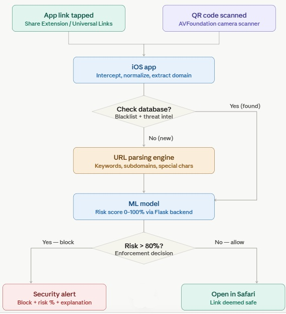

# AntiPhishing

AntiPhishing is a mobile information security project that aims to **identify Phishing links before the user opens them** – in any application (SMS / WhatsApp / Email / Safari / QR Codes) – and display **a risk score in percentage + a clear explanation to the user**

Authors: **Yahav Eliyahu, Ron Golan**

---

## Problem Statement

Phishing attacks are one of the most common and dangerous security problems today. Thousands of users fall for attacks every day that start with a single click on a link that can appear anywhere, whether it's on WhatsApp, SMS, email, or social networks, or even a physical QR code on a flyer or poster.

The core danger of phishing is that it rarely looks dangerous. Attackers excel at creating deceptive links that closely mimic legitimate ones. For instance, a domain might look nearly identical to the original, differing by just a single character—such as replacing the "l" in "PayPal" with a "1".

Furthermore, techniques like **QR code phishing** are particularly deceptive because they completely hide the destination URL from the user.

When attackers skillfully misuse the names of trusted banks, reputable corporations, or familiar services, the visual cues of a scam disappear entirely. This makes the threat incredibly sophisticated and highly dangerous—especially for older adults and those who are less technologically savvy.

Most existing solutions rely on known blacklists and Threat Intelligence databases, leaving users exposed to zero-day attacks and malicious QR codes in the physical world.

---

## Project Goal

Build a system that provides **Proactive Protection**:
- Show whether the link is **Safe / Suspicious**
- If suspicious: Show **Risk Level in percentage**
- Explain in simple terms why the link seems dangerous to teach the user.
(All before the damage happens, not after).

---

## Key Features

- **Cross-App Protection**: Intercept and analyze links from any iOS application via Share Extensions and Universal Links.
- **QR Code Scanning**: Built-in camera scanner that intercepts the encoded URL before opening it, displaying a risk assessment first.
- **On-device fast lexical analysis**: Fast client-side analysis based on URL characteristics (length, special characters, subdomains, suspicious TLDs, keywords like
- **Server-side ML scoring**: Sends the link to a backend service (Flask) that calculates additional signals and returns a probability/risk score.
- **Explainable Security**: User-readable explanations (e.g. new domain / suspicious keyword / unusual URL structure).
- **Logging + statistics**: Saves checked links locally and in the cloud to reduce reprocessing + displays statistics to the user.

  ---

  

---

## Algorithm

The system operates using a multi-layered pipeline to analyze and classify URLs in real time. QR codes introduce an additional interception step at the top of the pipeline:

1. **URL Interception**
Triggered either when:

- A user taps a link in an external app (via iOS Share Extension / Universal Links)
  
- A user scans a QR code using the in-app scanner (AVFoundation) — the encoded URL is extracted and passed into the pipeline before any navigation occurs.

2. **Optimization & Normalization**
At this stage, the system prepares the address for efficient and resource-saving comparison:

- **Normalization:** Converts to lowercase, strips tracking parameters, decodes percent-encoding, extracts the domain.

- **Cache/DB Lookup:** Checks whether the URL exists in the local database (blacklists + Threat Intelligence).

3. **Execution Flow**
Depending on the results of the database check, the algorithm splits into one of two paths:

- **Fast Path (Known Threat):** URL is in the DB → immediately classified as malicious → passed to model for final risk rating.

- **Deep Analysis Path (Zero-Day Analysis):** If the address is new (not in the DB):

  - The address is first saved in the DB to optimize future queries.

  - The address is passed to the heuristic analysis engine to identify new threats (Zero-Day).

4. **Feature Extraction**
For unknown addresses, the engine calculates statistical features from the URL, including:

- Address length.

- Number of subdomains.

- Lexical analysis: Identifying suspicious keywords (such as login, verify).

- Alpha-numeric ratio.

- Use of special and unusual characters (such as @, %).

- **QR-specific signal**: whether the URL was human-visible or hidden inside a QR code (added as a risk factor)

5. **Classification & Decision Logic**
The features are fed into a pre-trained machine learning model. The model returns a classification (safe/suspicious) and a risk score.

**Enforcement policy:**

- **Risk score above 80:** The link is defined as dangerous. The system blocks access and displays a security alert to the user with an explanation of the nature of the threat.

- **Otherwise:** The link is defined as safe and the system allows it to be opened in Safari.

---

## Architecture

**iOS App**
- Share Extension for cross-app link interception
- AVFoundation-based QR scanner with pre-navigation analysis
- URL normalization & feature extraction
- Local scoring + warning UI
- History/logs + statistics

**Backend**
- REST API endpoint for URL scoring
- Feature enrichment (e.g., hostname reputation, WHOIS/domain age if implemented)
- ML model inference + thresholding
- Logging/storage

---

## Research / References

The project relies on a review of Blacklist, Heuristics and ML approaches to identify Phishing URLs, including the use of WHOIS information and feature combinations.

---

## Tech Stack

- **iOS**: Swift, SwiftUI, AVFoundation (QR scanning), Share Extensions, SafariServices
- **Backend**: Flask
- **ML**: URL phishing classification using engineered features (lexical + host-based)
- **Storage**: mongoDB for history and caching

---

## Credits

Project by:

- Yahav Eliyahu

- Ron Golan
